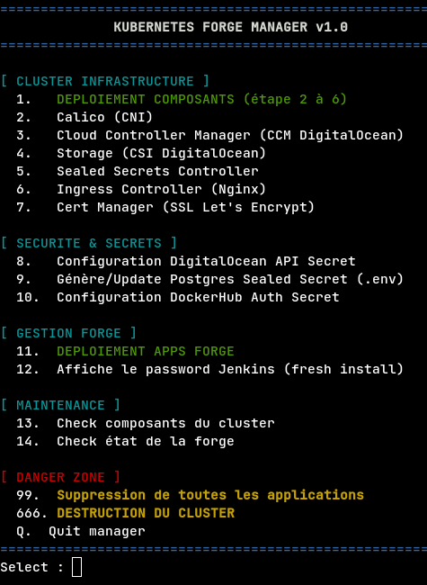

# Forge Kubernetes – Environnement DevOps Cloud (DigitalOcean)

Ce projet met en place une **infrastructure DevOps** sur un cluster Kubernetes déployé sur DigitalOcean. 
L'automatisation est au coeur du projet : de la configuration des nodes via **Ansible** au déploiement des services via un **script Manager intéractif**.

<p align="center">
  
</p>

---

## Contexte
Projet réalisé dans le cadre d'un TP **Orchestration Kubernetes**
Mastère **Expert en cloud, sécurité & infrastructure 2024/2026**

---

## Applications de la forge

| Couche | Technologie |
|------------|------|
| **Nginx** | Web Front Page |
| **Jenkins** | Serveur d'automatisation CI/CD |
| **Gitea** | Forge Git |
| **PostgreSQL** | Base de données pour Gitea |

--- 
Voici le rendu des ressources déployées dans le namespace `rt` :
<p align="center">
  
</p>

---

##  Stack Technique & Composants

| Couche | Technologie |
|------------|------|
| **Infrastructure** | DigitalOcean Droplets (Ubuntu 24.04) |
| **Configuration** | Ansible  |
| **Orchestration** | Kubernetes (kubadm) |
| **Réseau** | Calico + Ingress-Nginx  |
| **Cloud Controller Manager** | CCM DigitalOcean  |
| **Storage** | CSI DigitalOcean  |
| **Sécurité** | Bitnami Sealed Secrets + Cert-Manager  |
| **Applications** | Nginx, Gitea, Jenkins, PostgreSQL |

---

##  Workflow de déploiement

Le déploiement se déroule en trois phases  :

### Phase 1 : Bootstrapping du cluster (Ansible)
On prépare deux Droplets Ubuntu 24.04. Ansible se charge de transformer ces machines nues en un cluster Kubernetes fonctionnel
1. Configuration du `/etc/hosts` et de l'inventaire Ansible
2. Exécution du playbook `cluster.yml` (3 rôles : préparation des nodes, initialisation du Master, jonction des Workers)

### Phase 2 : Installation des briques infra (Manager Script)
Une fois le cluster UP, on utilise le script `./k8s_manager.sh` pour installer les composants essentiels :
- Réseau (CNI Calico), Storage (CSI DigitalOcean)
- Ingress Controller (pour obtenir l'IP publique)
- Sealed Secret pour chiffrer les secrets
- Ingress-Nginx pour joindre les applis depuis l'extérieur
- **Étape DNS** : Une fois l'IP du LoadBalancer obtenue, mise à jour des enregistrements A chez le fournisseur de domaine.

### Phase 3 : Déploiement de la Forge (Manager Script)
Installation des applications via le script manager :
- Configuration des secrets
- Déploiement de Nginx, PostgreSQL, Gitea et Jenkins

---

##  Quick Start

```bash
# 1. Cloner le projet
git clone https://github.com/thfx31/Ynov_k8s.git
cd Ynov_k8s

# 2. Préparation Ansible
cd ansible
vim inventory.yml  # Ajouter vos serveurs
ansible-playbook -i inventory.yml cluster.yml

# 3. Configuration locale
cd ..
cp .env.example .env && vim .env  # Vos credentials DB

# 4. Manager interactif
chmod +x script_manager.sh
./script_manager.sh
```

---
## Accès aux services
| Appli | URL |
|------------|------|
| **Nginx** | https://forge.yourdomain |
| **Jenkins** | https://jenkins.yourdomain  |
| **Gitea** | https://gitea.yourdomain |
| **Postgresql** | N/A |


---
## Documentation détaillée
Retrouvez les détails techniques et les schémas dans le dossier [`docs/`](docs/).

- [01- Schema de l'architecture](docs/01-infra.md)
- [02 - Ansible](docs/02-ansible.md)
- [03 - Script Manager](docs/03-script-manager.md)
- [04 - Securité](docs/04-securite.md)
- [05 - Admin manuel](docs/05-admin-manuel.md)
- [06 - Ressources](docs/06-ressources.md)


---
## Auteurs
- Projet réalisé par **Thomas FAUROUX** et **Robin THIRIET** 
- Mastère Expert en cloud, sécurité & infrastructure (2024-2026)
- Dépôt : https://github.com/thfx31/Ynov_k8s/

---
## Licence

Ce projet est distribué sous licence **MIT**.  
Vous pouvez librement le réutiliser et le modifier avec attribution.
