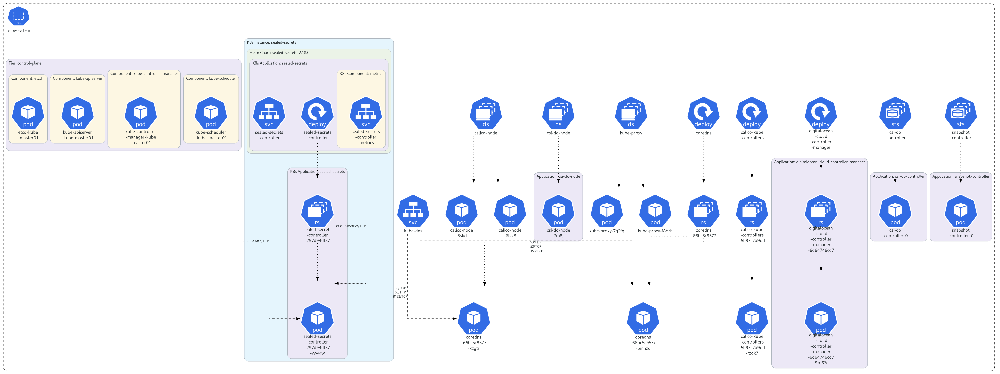

# Infrastructure & Core Cluster

Cette page décrit les composants fondamentaux installés sur le cluster (CNI, CSI, Ingress Controller..).

##  Vue du Namespace kube-system
Voici l'état des contrôleurs d'infrastructure généré via KubeDiagrams :

*On y retrouve notamment le contrôleur Sealed Secrets, le driver CSI DigitalOcean et le réseau Calico.*